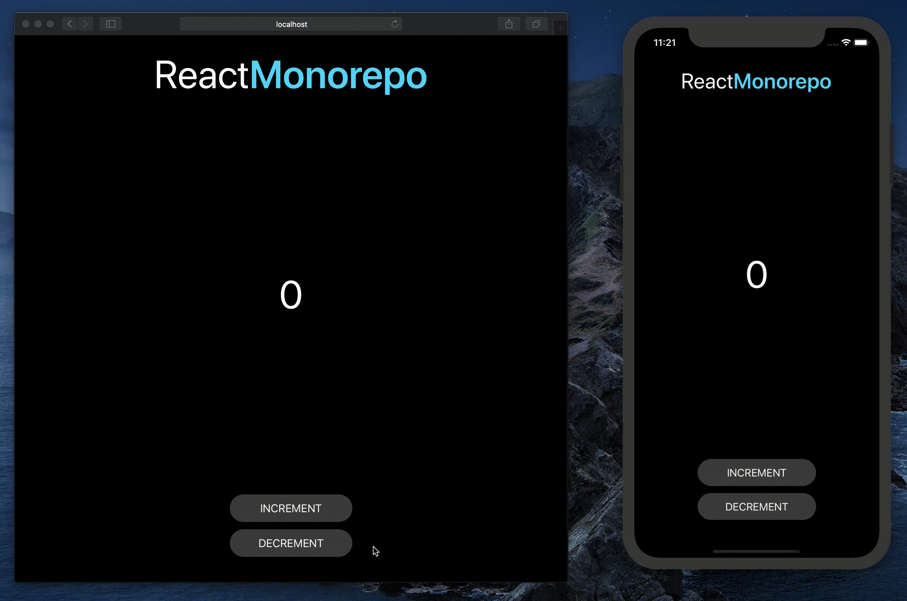

# React Monorepo

a simple monorepo setup for `react` & `react-native` using `yarn workspaces`.



## Getting Started

```sh
# root folder
yarn

# to run native
cd packages/native
yarn ios
yarn android

# to run web
cd packages/web
yarn start
```

## Acknowledgement

This repository made possible by the efforts of the amazing community ❤️ [Follow symlinks? #1](https://github.com/facebook/metro/issues/1)

[issue #1 for metro bundler... grrrr](https://github.com/facebook/metro/issues/1)

[working example](https://github.com/gorhom/react-monorepo)

[A concise guide to configuring React Native with Yarn Workspaces](https://medium.com/@huntie/a-concise-guide-to-configuring-react-native-with-yarn-workspaces-d7efa71b6906)

[Way more details in ios/android](https://engineering.brigad.co/react-native-monorepos-code-sharing-f6c08172b417)

## Contributing

Pull requests are welcome. For major changes, please open an issue first to discuss what you would like to change.

Please make sure to update tests as appropriate.

## License

[MIT](https://choosealicense.com/licenses/mit/)
